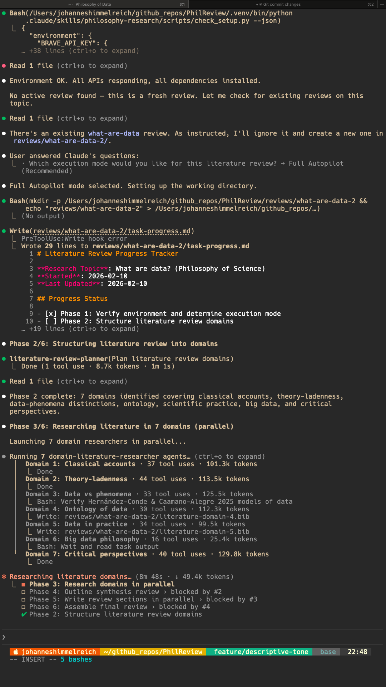

<p align="center">
  
</p>

<h1 align="center">PhilLit</h1>

<p align="center">
  <a href="LICENSE"></a>
  <a href="https://www.python.org/"></a>
  <a href="https://claude.com/product/claude-code"></a>
</p>

PhilLit generates analytical literature reviews with verified bibliographies for philosophy research. Give it a topic description, and it searches academic databases, collects and checks references, and writes a structured review — typically in half an hour.

PhilLit is **open-source**. Anyone can use it — no enrollment or permission required.

## Example Reviews

- [Extended Mind and Cognitive Offloading](reviews/extended-mind-cognitive-offloading/literature-review-final.md)
- [Metaphilosophy of Literature Reviews](reviews/metaphilosophy-literature-reviews/literature-review-final.md)
- [Moral Value of DIY](reviews/moral-value-diy/literature-review-final.md)

## Highlights

- **Searches multiple academic databases** — Semantic Scholar, PhilPapers, SEP, IEP, OpenAlex, CORE, arXiv, and NDPR
- **Checks every reference** — All citations are sourced from academic databases (not generated by the LLM) and validated against CrossRef
- **Produces a structured review** with a bibliography you can import into Zotero, BibDesk, or any reference manager
- **Outputs a Word document and a BibTeX file** ready for reference managers or LaTeX

## What does it cost?

PhilLit itself is free. Running it requires [Claude Code](https://docs.anthropic.com/en/docs/claude-code), which needs a subscription or API access. Each literature review uses roughly **$9** to **$13 in API credits**, depending on whether you use Sonnet or Opus. 

## Quick Start

**What you need:**

- [Claude Code](https://docs.anthropic.com/en/docs/claude-code) — the AI coding tool that runs PhilLit
- A [Brave Search API key](https://brave.com/search/api/) (free tier available)
- Optionally, a [Semantic Scholar API key](https://www.semanticscholar.org/product/api#api-key) (free) for better search results

Setup takes about 10 minutes. See [GETTING_STARTED.md](GETTING_STARTED.md) for step-by-step instructions.

**Once set up**, describe your topic and PhilLit does the rest (~45 minutes):

```
I need a literature review on [topic].

[Describe the topic in 1-5 paragraphs]
```

<p align="center">
  
</p>

## How It Works

1. **Plan** — Breaks your topic into searchable research domains
2. **Research** — Searches academic databases for each domain, collects and verifies references
3. **Outline** — Designs the structure of the review based on the collected literature
4. **Write** — Drafts each section of the review
5. **Assemble** — Combines sections into a final document with a complete bibliography

## Development

- Instructions on contributing: `CONTRIBUTING.md`
- Agent architecture: `.claude/docs/ARCHITECTURE.md`
- Claude instructions: `CLAUDE.md`

### Output Structure

Each review is saved in its own directory under `reviews/`:

```
reviews/[topic]/
├── literature-review-final.docx      # Complete review
├── literature-all.bib              # Aggregated bibliography
└── intermediate_files/
    ├── json/                       # API response files (archived)
    ├── lit-review-plan.md          # Domain decomposition
    ├── literature-domain-*.bib     # Per-domain BibTeX files
    ├── synthesis-outline.md        # Review structure
    ├── synthesis-section-*.md      # Individual sections
    └── task-progress.md            # Progress tracker
```

## Contact

- **Johannes Himmelreich** — Syracuse University — [jrhimmel@syr.edu](mailto:jrhimmel@syr.edu)
- **Marco Meyer** — University of Hamburg — [marco.meyer@uni-hamburg.de](mailto:marco.meyer@uni-hamburg.de)

---

Inspired by [LiRA](https://arxiv.org/abs/2510.05138) multi-agent patterns.
